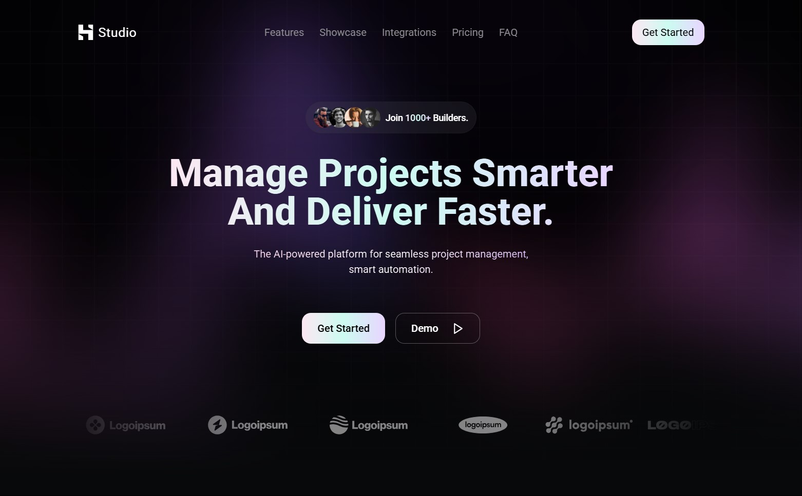

<p align="center">
  
</p>

<h1 align="center">Hero Studio</h1>

<p align="center">
  <em>A Modern SaaS Landing Page Template</em>
</p>

<p align="center">
  
  
  
  
  
</p>

<h2 align="center">Powered By</h2>
<p align="center">
  

</p>
<p align="center">
  <a href="https://heroui.dev">HeroUI</a>

</p>

<br>

<p align="center">
  
</p>

HeroUI Studio is a dark themed cutting-edge SaaS landing page template that combines stunning visual design with powerful functionality. Built with Next.js and enhanced by HeroUI's component library, this template delivers an exceptional user experience that converts visitors into customers.

## ✨ Key Features

- **Modern Design System:** Leverages HeroUI's comprehensive component library for consistent, beautiful UI elements
- **Responsive Layout:** Perfect display across all devices with mobile-first design principles
- **Performance Optimized:** Built with Next.js for lightning-fast page loads and SEO benefits
- **Accessibility First:** WCAG 2.1 compliant components from HeroUI

## 🎯 Use Cases

- SaaS Product Launches
- Startup Landing Pages

## 🏗️ Tech Stack

- **Frontend:** Next.js 15 with TypeScript
- **Styling:** Tailwind CSS
- **Components:** HeroUI Component Library
- **Animations:** Framer Motion
- **Deployment:** Vercel

## 🚀 Getting Started

1. **Clone the repository:**

   ```bash
   git clone https://github.com/manasseh-zw/hero-studio.git
   ```

2. **Install dependencies:**

   ```bash
   bun install
   ```

3. **Run the development server:**

   ```bash
   bun run dev
   ```

4. **Open [http://localhost:3000](http://localhost:3000) in your browser**

## 💡 HeroUI Integration

This template showcases the power of HeroUI's component library:

- **Component Library:** A comprehensive collection of pre-built, accessible components
- **Design System:** Consistent spacing, typography, and color schemes
- **Theme Support:** Easy customization through HeroUI's theming system
- **Responsive Design:** Mobile-first approach with HeroUI's responsive utilities

## 📚 Documentation

For detailed documentation on using this template with HeroUI , visit:

- [HeroUI Documentation](https://heroui.com) - Component library documentation

## 🔗 Links

<div align="center">
  <a href="https://github.com/manasseh-zw/hero-studio">
    
  </a>&nbsp;&nbsp;
  
  <a href="https://heroui.com">
    
  </a>&nbsp;&nbsp;
  
  <a href="https://heroui.chat">
    
  </a>
</div>

---

<p align="center">
  <em>Built with ❤️ using HeroUI and HeroUI.Chat</em>
</p>
